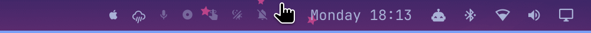

# Boot macOS — Omarchy bar widget

A one-click bar button for [Omarchy](https://omarchy.org/) that reboots your
Asahi Linux Mac into macOS — for the **next boot only**, so the machine comes
back to Linux on the boot after that.

Clicking the  icon opens a floating terminal that confirms, selects the
macOS volume via `asahi-bless`, and reboots.



## Requirements

- Any Apple Silicon Mac running [Asahi Linux](https://asahilinux.org/) with
  Omarchy — MacBook Air/Pro, Mac mini, Mac Studio, iMac all work.
- A macOS install to boot into (the usual Asahi dual-boot setup).
- [`asahi-bless`](https://github.com/WhatAmISupposedToPutHere/asahi-bless):
  `omarchy pkg add asahi-bless`

If your machine has more than one macOS volume, `asahi-bless --set-boot-macos`
refuses to guess; the script tells you and leaves the system untouched.

## Install

```bash
omarchy plugin add https://github.com/Sudhanshugtm/omarchy-boot-macos.git --enable
```

Or try it straight from a local checkout by copying the folder to
`~/.config/omarchy/plugins/sid.boot-macos/` and running
`omarchy plugin enable sid.boot-macos`.

## Remove

```bash
omarchy plugin remove sid.boot-macos
```

This deletes the plugin folder and takes the widget off the bar. Nothing else
is touched — the plugin never modifies any configuration outside its own bar
placement, and `asahi-bless` stays installed until you remove it yourself
(`sudo pacman -R asahi-bless`).

## How it works

- `BarWidget.qml` — the bar icon; launches the script in Omarchy's floating
  presentation terminal so `sudo` can prompt for your password.
- `boot-macos` — confirms with `gum`, runs
  `sudo asahi-bless --next --set-boot-macos --yes`, then
  `sudo systemctl reboot`. `--next` means the boot preference is one-shot:
  nothing about your default boot order changes.

## License

MIT — see [LICENSE](LICENSE).
